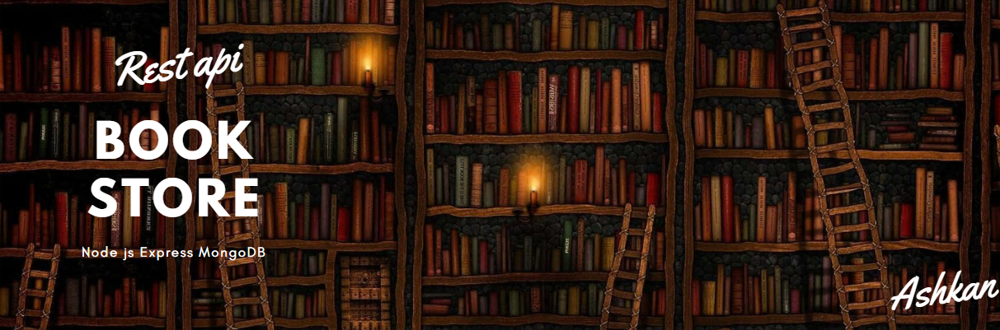

# A Book-Store REST API With [Node](https://nodejs.org/), [Express](https://expressjs.com/), [MongoDB](https://www.mongodb.com/)



Features :

* MVC Architecture
* MongoDB & Mongoose connect, Database creation
* Controllers creation
* Middlewares creation
* JsonWebToken  based authentication
* Postman testing
* Create, Read, Update, Delete

### Description

A rest api I created to level up my skills and has authentication.for the user can add a book that everyone can see and only the person who owns the book can edit or delete the book.

### Install packages
```
npm i
```

### Setup .env file
``` javascript
MONGODB_URL = 
PORT = 
JWT_SECRET =
```

### Start the app
```
npm run dev
```